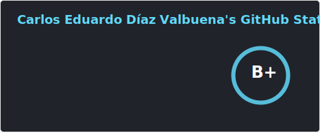
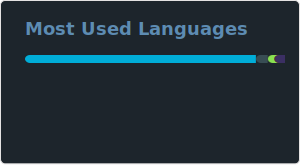

### Hi there 👋

Welcome to my **Github**!

I'm Carlos (but my friends call me Carlitos 😝), I was born in Bogota 🇨🇴

- 🔭 I’m currently working on [@Zuluapp](https://github.com/zuluapp) as **Tech Manager / Software Expert**.
- 🌱 I’m currently learning **a lot** about **Blockchain**, **Optimal Smart Contracts**, **DevOps on AWS**, and so much more!, it's crazy!
- 👯 I'm always willing to help with anything, just go ahead and ask!
- 💬 Ask me about **anything** about **programming**, and why not, motorcycles! 🏍
- 😄 Pronouns: he/him
- ⚡ Fun fact: my friends call me Carlitos because I'm tall! I'm 198cms tall! 😨

## 🌐 Socials:
 

# 💻 Tech Stack:

                                                                                    	       	                   

## 📈 Stats

## 🏆 GitHub Trophies

---

<!--### 😂 Random Dev Meme
-->
